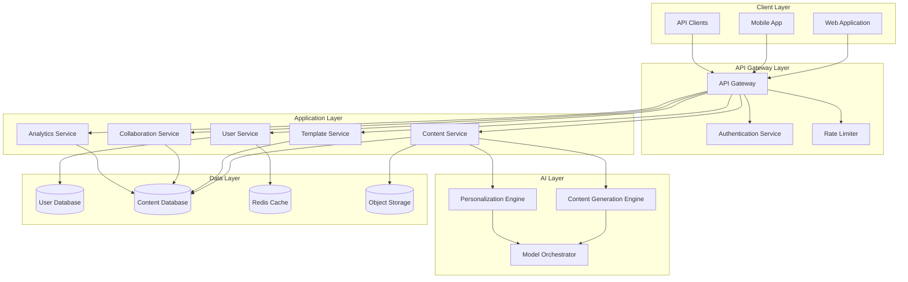

# Design Document: SmartContent AI Platform

## Overview

SmartContent AI is a cloud-based platform that leverages large language models (LLMs) and machine learning to provide intelligent content generation and personalization services. The platform follows a microservices architecture with clear separation between user-facing services, AI processing, and data management layers.

The system is designed to handle concurrent users generating content simultaneously while maintaining sub-30-second response times. The architecture prioritizes scalability, security, and extensibility to support future content types and AI model improvements.

## Architecture

### High-Level Architecture



### Design Principles

1. **Separation of Concerns**: Each service has a single, well-defined responsibility
2. **Stateless Services**: Application services maintain no session state, enabling horizontal scaling
3. **Asynchronous Processing**: Long-running AI operations use async patterns to avoid blocking
4. **Caching Strategy**: Frequently accessed data (templates, user profiles) cached in Redis
5. **Security by Default**: All endpoints require authentication; data encrypted at rest and in transit

## Components and Interfaces

### 1. API Gateway

**Responsibility**: Entry point for all client requests, handles routing, authentication, and rate limiting.

**Key Operations**:
- `routeRequest(request: HttpRequest): HttpResponse` - Routes incoming requests to appropriate services
- `validateToken(token: string): AuthResult` - Validates JWT tokens with Authentication Service
- `checkRateLimit(userId: string, endpoint: string): boolean` - Enforces rate limits per user/endpoint

**Dependencies**: Authentication Service, all application services

### 2. Authentication Service

**Responsibility**: Manages user authentication, authorization, and session management.

**Key Operations**:
- `register(email: string, password: string, userType: UserType): User` - Creates new user account
- `login(email: string, password: string): AuthToken` - Authenticates user and returns JWT
- `validateToken(token: string): TokenValidation` - Verifies token validity and extracts claims
- `refreshToken(refreshToken: string): AuthToken` - Issues new access token
- `logout(token: string): void` - Invalidates token

**Data Model**:
```typescript
interface User {
  id: string;
  email: string;
  passwordHash: string;
  userType: 'creator' | 'influencer' | 'student' | 'business';
  createdAt: Date;
  lastLogin: Date;
}

interface AuthToken {
  accessToken: string;
  refreshToken: string;
  expiresIn: number;
}
```

### 3. User Service

**Responsibility**: Manages user profiles, preferences, and style settings.

**Key Operations**:
- `getProfile(userId: string): UserProfile` - Retrieves user profile
- `updateProfile(userId: string, updates: ProfileUpdates): UserProfile` - Updates profile settings
- `getStylePreferences(userId: string): StylePreferences` - Retrieves personalization settings
- `updateStylePreferences(userId: string, prefs: StylePreferences): void` - Updates style settings
- `deleteUser(userId: string): void` - Removes user and all associated data

**Data Model**:
```typescript
interface UserProfile {
  userId: string;
  displayName: string;
  preferences: {
    defaultContentType: string;
    defaultTone: string;
    targetAudience: string;
  };
  styleGuide: StylePreferences;
  subscription: SubscriptionTier;
}

interface StylePreferences {
  tone: 'professional' | 'casual' | 'friendly' | 'authoritative' | 'creative';
  vocabulary: 'simple' | 'moderate' | 'advanced';
  sentenceLength: 'short' | 'medium' | 'long';
  brandVoice: string;
  customGuidelines: string[];
}
```

### 4. Content Service

**Responsibility**: Orchestrates content generation, manages content lifecycle, and coordinates with AI engines.

**Key Operations**:
- `generateContent(request: GenerationRequest): ContentDraft` - Initiates content generation
- `getContentVariations(contentId: string, count: number): ContentDraft[]` - Generates alternative versions
- `saveContent(userId: string, content: ContentDraft): Content` - Persists content
- `updateContent(contentId: string, updates: ContentUpdates): Content` - Modifies existing content
- `getContentHistory(userId: string, filters: HistoryFilters): Content[]` - Retrieves user's content
- `deleteContent(contentId: string): void` - Removes content
- `exportContent(contentId: string, format: ExportFormat): Blob` - Exports in specified format

**Data Model**:
```typescript
interface GenerationRequest {
  userId: string;
  contentType: 'text' | 'caption' | 'blog' | 'marketing';
  prompt: string;
  templateId?: string;
  parameters: {
    length?: number;
    tone?: string;
    keywords?: string[];
    targetAudience?: string;
  };
}

interface ContentDraft {
  id: string;
  userId: string;
  contentType: string;
  generatedText: string;
  metadata: {
    prompt: string;
    modelUsed: string;
    generationTime: number;
    tokensUsed: number;
  };
  status: 'draft' | 'reviewed' | 'published';
  createdAt: Date;
}

interface Content extends ContentDraft {
  versions: ContentVersion[];
  tags: string[];
  sharedWith: string[];
}
```

### 5. Content Generation Engine

**Responsibility**: Interfaces with LLM models to generate content based on user requests.

**Key Operations**:
- `generate(request: GenerationRequest, stylePrefs: StylePreferences): string` - Generates content using AI
- `generateVariations(baseContent: string, count: number, stylePrefs: StylePreferences): string[]` - Creates variations
- `buildPrompt(request: GenerationRequest, stylePrefs: StylePreferences): string` - Constructs LLM prompt

**Implementation Details**:
- Uses prompt engineering to incorporate user preferences and style guidelines
- Implements retry logic for model API failures
- Tracks token usage for billing and analytics
- Supports multiple LLM providers (OpenAI, Anthropic, etc.) through Model Orchestrator

### 6. Personalization Engine

**Responsibility**: Learns from user behavior and applies personalization to content generation.

**Key Operations**:
- `analyzeUserEdits(originalContent: string, editedContent: string): StyleInsights` - Learns from edits
- `updateStyleModel(userId: string, insights: StyleInsights): void` - Updates personalization model
- `getPersonalizationContext(userId: string): PersonalizationContext` - Retrieves learned preferences
- `applyPersonalization(content: string, context: PersonalizationContext): string` - Applies learned style

**Data Model**:
```typescript
interface StyleInsights {
  preferredPhrases: string[];
  avoidedPhrases: string[];
  sentenceStructurePatterns: string[];
  vocabularyPreferences: Map<string, string>;
}

interface PersonalizationContext {
  userId: string;
  learnedPreferences: StyleInsights;
  contentHistory: ContentSummary[];
  successMetrics: {
    acceptanceRate: number;
    editFrequency: number;
  };
}
```

### 7. Template Service

**Responsibility**: Manages content templates and template-based generation.

**Key Operations**:
- `getTemplates(category?: string): Template[]` - Retrieves available templates
- `getTemplate(templateId: string): Template` - Gets specific template
- `createCustomTemplate(userId: string, template: TemplateDefinition): Template` - Creates user template
- `applyTemplate(templateId: string, data: TemplateData): string` - Fills template with data

**Data Model**:
```typescript
interface Template {
  id: string;
  name: string;
  category: 'social' | 'marketing' | 'education' | 'business';
  structure: string;
  placeholders: Placeholder[];
  isCustom: boolean;
  createdBy?: string;
}

interface Placeholder {
  name: string;
  type: 'text' | 'number' | 'list';
  required: boolean;
  description: string;
}
```

### 8. Collaboration Service

**Responsibility**: Enables multi-user collaboration on content and team workspaces.

**Key Operations**:
- `shareContent(contentId: string, userIds: string[], permissions: Permission[]): void` - Shares content
- `getSharedContent(userId: string): Content[]` - Retrieves content shared with user
- `lockContent(contentId: string, userId: string): Lock` - Acquires edit lock
- `unlockContent(contentId: string, userId: string): void` - Releases edit lock
- `trackChange(contentId: string, change: ContentChange): void` - Records collaborative edit

**Data Model**:
```typescript
interface Permission {
  userId: string;
  level: 'view' | 'edit' | 'admin';
  grantedAt: Date;
  grantedBy: string;
}

interface Lock {
  contentId: string;
  lockedBy: string;
  lockedAt: Date;
  expiresAt: Date;
}

interface ContentChange {
  contentId: string;
  userId: string;
  changeType: 'edit' | 'comment' | 'approve';
  timestamp: Date;
  details: any;
}
```

### 9. Analytics Service

**Responsibility**: Tracks usage metrics, generates reports, and provides insights.

**Key Operations**:
- `trackGeneration(userId: string, contentType: string, metadata: GenerationMetadata): void` - Records generation event
- `getUserAnalytics(userId: string, timeRange: TimeRange): AnalyticsReport` - Generates user report
- `getUsageTrends(userId: string): UsageTrends` - Analyzes usage patterns
- `exportReport(userId: string, timeRange: TimeRange, format: string): Blob` - Exports analytics

**Data Model**:
```typescript
interface AnalyticsReport {
  userId: string;
  timeRange: TimeRange;
  totalGenerations: number;
  contentTypeBreakdown: Map<string, number>;
  averageGenerationTime: number;
  tokenUsage: number;
  satisfactionScore: number;
}

interface UsageTrends {
  dailyGenerations: TimeSeries;
  popularContentTypes: string[];
  peakUsageHours: number[];
}
```

### 10. Model Orchestrator

**Responsibility**: Manages connections to multiple LLM providers and handles model selection.

**Key Operations**:
- `selectModel(contentType: string, requirements: ModelRequirements): ModelConfig` - Chooses appropriate model
- `invokeModel(modelConfig: ModelConfig, prompt: string): ModelResponse` - Calls LLM API
- `handleFailover(failedModel: string, prompt: string): ModelResponse` - Switches to backup model

## Data Models

### Database Schema

**Users Table**:
```sql
CREATE TABLE users (
  id UUID PRIMARY KEY,
  email VARCHAR(255) UNIQUE NOT NULL,
  password_hash VARCHAR(255) NOT NULL,
  user_type VARCHAR(50) NOT NULL,
  created_at TIMESTAMP DEFAULT CURRENT_TIMESTAMP,
  last_login TIMESTAMP,
  subscription_tier VARCHAR(50) DEFAULT 'free'
);
```

**User Profiles Table**:
```sql
CREATE TABLE user_profiles (
  user_id UUID PRIMARY KEY REFERENCES users(id) ON DELETE CASCADE,
  display_name VARCHAR(255),
  preferences JSONB,
  style_guide JSONB,
  updated_at TIMESTAMP DEFAULT CURRENT_TIMESTAMP
);
```

**Content Table**:
```sql
CREATE TABLE content (
  id UUID PRIMARY KEY,
  user_id UUID REFERENCES users(id) ON DELETE CASCADE,
  content_type VARCHAR(50) NOT NULL,
  generated_text TEXT NOT NULL,
  metadata JSONB,
  status VARCHAR(50) DEFAULT 'draft',
  created_at TIMESTAMP DEFAULT CURRENT_TIMESTAMP,
  updated_at TIMESTAMP DEFAULT CURRENT_TIMESTAMP,
  tags TEXT[],
  INDEX idx_user_created (user_id, created_at DESC),
  INDEX idx_content_type (content_type),
  INDEX idx_tags (tags)
);
```

**Templates Table**:
```sql
CREATE TABLE templates (
  id UUID PRIMARY KEY,
  name VARCHAR(255) NOT NULL,
  category VARCHAR(50) NOT NULL,
  structure TEXT NOT NULL,
  placeholders JSONB,
  is_custom BOOLEAN DEFAULT FALSE,
  created_by UUID REFERENCES users(id) ON DELETE SET NULL,
  created_at TIMESTAMP DEFAULT CURRENT_TIMESTAMP,
  INDEX idx_category (category),
  INDEX idx_custom (is_custom, created_by)
);
```

**Collaboration Table**:
```sql
CREATE TABLE content_sharing (
  id UUID PRIMARY KEY,
  content_id UUID REFERENCES content(id) ON DELETE CASCADE,
  shared_with UUID REFERENCES users(id) ON DELETE CASCADE,
  permission_level VARCHAR(50) NOT NULL,
  granted_by UUID REFERENCES users(id),
  granted_at TIMESTAMP DEFAULT CURRENT_TIMESTAMP,
  UNIQUE(content_id, shared_with)
);
```

**Analytics Events Table**:
```sql
CREATE TABLE analytics_events (
  id UUID PRIMARY KEY,
  user_id UUID REFERENCES users(id) ON DELETE CASCADE,
  event_type VARCHAR(50) NOT NULL,
  content_type VARCHAR(50),
  metadata JSONB,
  timestamp TIMESTAMP DEFAULT CURRENT_TIMESTAMP,
  INDEX idx_user_timestamp (user_id, timestamp DESC),
  INDEX idx_event_type (event_type)
);
```

### Caching Strategy

**Redis Cache Structure**:
- User profiles: `user:profile:{userId}` (TTL: 1 hour)
- Style preferences: `user:style:{userId}` (TTL: 1 hour)
- Templates: `template:{templateId}` (TTL: 24 hours)
- Template lists: `templates:category:{category}` (TTL: 6 hours)
- Rate limit counters: `ratelimit:{userId}:{endpoint}` (TTL: 1 minute)


## Correctness Properties

*A property is a characteristic or behavior that should hold true across all valid executions of a system—essentially, a formal statement about what the system should do. Properties serve as the bridge between human-readable specifications and machine-verifiable correctness guarantees.*

### Property 1: User Registration Creates Account
*For any* valid registration data (email, password, user type), submitting a registration request should result in a new user account being created with a unique user ID.
**Validates: Requirements 1.1**

### Property 2: Valid Credentials Grant Authentication
*For any* user account with valid credentials, authentication should succeed and return a valid JWT token with appropriate claims.
**Validates: Requirements 1.2**

### Property 3: Profile Updates Round Trip
*For any* user profile and any valid profile updates, updating the profile then retrieving it should return the updated values.
**Validates: Requirements 1.3**

### Property 4: Invalid Credentials Rejected
*For any* invalid credential combination (wrong password, non-existent email, malformed input), authentication should fail and return an appropriate error message.
**Validates: Requirements 1.4**

### Property 5: Style Preferences Applied to Generation
*For any* user profile with style preferences and any generation request, the generated content should reflect the specified tone, vocabulary level, and sentence length preferences.
**Validates: Requirements 2.2**

### Property 6: Multiple Format Generation Completeness
*For any* generation request specifying multiple output formats, the response should contain content in all requested formats.
**Validates: Requirements 2.3**

### Property 7: Incomplete Requests Prompt for Details
*For any* generation request missing required fields, the platform should return a prompt identifying the missing information rather than attempting generation.
**Validates: Requirements 2.4**

### Property 8: Style Guidelines Persistence
*For any* user-provided style guidelines, after saving them to the profile, all subsequent content generation should incorporate those guidelines.
**Validates: Requirements 3.1**

### Property 9: Consistent Personalization Across Generations
*For any* user profile with style settings, generating multiple pieces of content should apply consistent personalization (same tone, vocabulary, style) across all outputs.
**Validates: Requirements 3.3**

### Property 10: Target Audience Adaptation
*For any* target audience specification (age group, profession, expertise level), generated content should adapt vocabulary and complexity to match the specified audience.
**Validates: Requirements 3.5**

### Property 11: Template Selection Generates Content
*For any* valid template selection, the platform should generate content that populates all template placeholders with appropriate AI-generated text.
**Validates: Requirements 4.2**

### Property 12: Custom Template Round Trip
*For any* custom template created by a user, saving it then retrieving it from the user's profile should return an equivalent template with the same structure and placeholders.
**Validates: Requirements 4.3**

### Property 13: Template Structure Preservation
*For any* template with defined structural elements (sections, placeholders, formatting), generating content using that template should preserve all structural elements while filling in the content.
**Validates: Requirements 4.4**

### Property 14: Content Draft Return
*For any* completed content generation request, the platform should return a Content_Draft object containing the generated text and metadata.
**Validates: Requirements 5.1**

### Property 15: Content Edit Round Trip
*For any* content draft and any valid modifications, saving the modifications then retrieving the content should return the modified version.
**Validates: Requirements 5.2**

### Property 16: Multiple Version Storage
*For any* content item, saving multiple versions should result in all versions being retrievable and distinguishable by version number or timestamp.
**Validates: Requirements 5.5**

### Property 17: Content History Persistence
*For any* generated content, it should appear in the user's content history immediately after generation and remain retrievable until explicitly deleted.
**Validates: Requirements 6.1**

### Property 18: Content Organization by Attributes
*For any* content with tags, type, or date metadata, querying the content history with filters matching those attributes should return that content in the results.
**Validates: Requirements 6.3**

### Property 19: Content Deletion Completeness
*For any* content item, after deletion, attempting to retrieve that content should fail with a "not found" error, and it should not appear in any search results or history queries.
**Validates: Requirements 6.4**

### Property 20: Multi-Format Export Support
*For any* content item, export operations should succeed for all supported formats (plain text, PDF, JSON), and each exported file should contain the complete content.
**Validates: Requirements 6.5**

### Property 21: Content Sharing Grants Access
*For any* content item and any set of user IDs, sharing the content with those users should result in all specified users being able to access the content.
**Validates: Requirements 7.1**

### Property 22: Permission Grant Accuracy
*For any* content sharing operation with specified permissions (view, edit, admin), the granted permissions should match exactly what was specified, and users should only be able to perform actions allowed by their permission level.
**Validates: Requirements 7.2**

### Property 23: Edit Lock Prevents Concurrent Modifications
*For any* shared content, when one user acquires an edit lock, other users should be unable to modify the content until the lock is released.
**Validates: Requirements 7.3**

### Property 24: Collaborative Change Tracking
*For any* modification made to shared content, the change should be recorded with the user ID of who made the change and a timestamp, and this record should be retrievable from the change history.
**Validates: Requirements 7.4**

### Property 25: Shared Workspace Resources
*For any* team workspace, all members should have access to the same template library and style guides, and changes to shared resources should be visible to all members.
**Validates: Requirements 7.5**

### Property 26: Generation Count Accuracy
*For any* user, after generating N pieces of content, the analytics should report exactly N generations for that user.
**Validates: Requirements 8.1**

### Property 27: Analytics Report Export
*For any* time period specification, requesting an analytics report export should produce a downloadable file containing generation statistics for that period.
**Validates: Requirements 8.5**

### Property 28: API and Web Interface Parity
*For any* content generation request, submitting it via the API with valid authentication should produce equivalent results to submitting the same request through the web interface.
**Validates: Requirements 9.2**

### Property 29: Rate Limit Error Handling
*For any* user exceeding their rate limit on an endpoint, subsequent requests should be rejected with a 429 status code and include retry-after information.
**Validates: Requirements 9.4**

### Property 30: Data Deletion Completeness
*For any* user requesting account deletion, all personal data (profile, content, analytics) should be removed from the system and no longer retrievable.
**Validates: Requirements 10.3**

## Error Handling

### Error Categories

1. **Validation Errors** (400 Bad Request)
   - Invalid input format
   - Missing required fields
   - Out-of-range values
   - Response: Detailed error message identifying the validation failure

2. **Authentication Errors** (401 Unauthorized)
   - Invalid credentials
   - Expired token
   - Missing authentication
   - Response: Generic authentication failure message (avoid leaking user existence)

3. **Authorization Errors** (403 Forbidden)
   - Insufficient permissions
   - Resource access denied
   - Response: Permission denied message

4. **Resource Errors** (404 Not Found)
   - Content not found
   - Template not found
   - User not found
   - Response: Specific resource type not found

5. **Rate Limit Errors** (429 Too Many Requests)
   - API rate limit exceeded
   - Generation quota exceeded
   - Response: Rate limit details and retry-after header

6. **Server Errors** (500 Internal Server Error)
   - AI model failures
   - Database connection errors
   - Unexpected exceptions
   - Response: Generic error message, detailed logging for debugging

### Error Response Format

All errors follow a consistent JSON structure:

```json
{
  "error": {
    "code": "ERROR_CODE",
    "message": "Human-readable error message",
    "details": {
      "field": "specific field that caused error",
      "reason": "detailed explanation"
    },
    "requestId": "unique-request-id-for-tracking"
  }
}
```

### Retry Strategy

- **Transient Errors**: Implement exponential backoff for AI model timeouts and temporary service unavailability
- **Rate Limits**: Respect retry-after headers and implement client-side backoff
- **Idempotency**: All POST/PUT operations use idempotency keys to safely retry

### Circuit Breaker Pattern

For AI model calls:
- Open circuit after 5 consecutive failures
- Half-open state after 30 seconds
- Close circuit after 3 successful calls
- Fallback: Return cached content or error message

## Testing Strategy

### Dual Testing Approach

The platform requires both unit testing and property-based testing for comprehensive coverage:

- **Unit Tests**: Verify specific examples, edge cases, and error conditions
- **Property Tests**: Verify universal properties across all inputs through randomization

Both approaches are complementary and necessary. Unit tests catch concrete bugs in specific scenarios, while property tests verify general correctness across a wide input space.

### Property-Based Testing Configuration

**Framework Selection**:
- **TypeScript/JavaScript**: Use `fast-check` library
- **Python**: Use `hypothesis` library

**Test Configuration**:
- Minimum 100 iterations per property test (due to randomization)
- Each property test must reference its design document property
- Tag format: `Feature: smartcontent-ai, Property {number}: {property_text}`

**Example Property Test Structure** (TypeScript with fast-check):

```typescript
import fc from 'fast-check';

describe('Feature: smartcontent-ai, Property 3: Profile Updates Round Trip', () => {
  it('should persist and retrieve profile updates correctly', async () => {
    await fc.assert(
      fc.asyncProperty(
        fc.record({
          displayName: fc.string(),
          defaultTone: fc.constantFrom('professional', 'casual', 'friendly'),
          targetAudience: fc.string()
        }),
        async (profileUpdates) => {
          // Arrange: Create user and get initial profile
          const userId = await createTestUser();
          
          // Act: Update profile and retrieve
          await userService.updateProfile(userId, profileUpdates);
          const retrieved = await userService.getProfile(userId);
          
          // Assert: Retrieved values match updates
          expect(retrieved.displayName).toBe(profileUpdates.displayName);
          expect(retrieved.preferences.defaultTone).toBe(profileUpdates.defaultTone);
          expect(retrieved.preferences.targetAudience).toBe(profileUpdates.targetAudience);
        }
      ),
      { numRuns: 100 }
    );
  });
});
```

### Unit Testing Strategy

**Focus Areas for Unit Tests**:
1. **Specific Examples**: Concrete test cases demonstrating correct behavior
2. **Edge Cases**: Empty inputs, maximum lengths, boundary values
3. **Error Conditions**: Invalid inputs, missing data, constraint violations
4. **Integration Points**: Service-to-service communication, database operations

**Avoid Over-Testing**:
- Don't write exhaustive unit tests for all input combinations (property tests handle this)
- Focus unit tests on specific scenarios that demonstrate important behaviors
- Use unit tests for integration testing between components

**Example Unit Test**:

```typescript
describe('Content Generation Service', () => {
  it('should generate blog post with specific template', async () => {
    // Arrange
    const request = {
      userId: 'test-user-123',
      contentType: 'blog',
      prompt: 'Write about AI in healthcare',
      templateId: 'blog-template-1'
    };
    
    // Act
    const result = await contentService.generateContent(request);
    
    // Assert
    expect(result.contentType).toBe('blog');
    expect(result.generatedText).toContain('healthcare');
    expect(result.metadata.templateId).toBe('blog-template-1');
  });
  
  it('should handle empty prompt gracefully', async () => {
    // Arrange
    const request = {
      userId: 'test-user-123',
      contentType: 'text',
      prompt: ''
    };
    
    // Act & Assert
    await expect(contentService.generateContent(request))
      .rejects
      .toThrow('Prompt is required');
  });
});
```

### Integration Testing

**Test Scenarios**:
1. End-to-end content generation flow (request → AI processing → storage → retrieval)
2. Authentication flow (register → login → access protected resource)
3. Collaboration flow (share content → collaborator edits → change tracking)
4. Analytics pipeline (generate content → track event → view analytics)

### Performance Testing

**Key Metrics**:
- Content generation latency: < 30 seconds (p95)
- API response time: < 200ms for non-generation endpoints (p95)
- Database query time: < 100ms (p95)
- Concurrent user capacity: 1000 simultaneous users

**Load Testing Scenarios**:
- Sustained load: 100 requests/second for 1 hour
- Spike test: 0 to 500 requests/second in 1 minute
- Stress test: Gradually increase load until system degradation

### Security Testing

**Test Areas**:
1. Authentication bypass attempts
2. SQL injection in search and filter operations
3. XSS in user-generated content
4. CSRF protection on state-changing operations
5. Rate limit enforcement
6. Data encryption verification (at rest and in transit)

### Monitoring and Observability

**Metrics to Track**:
- Request rate and latency by endpoint
- Error rate by error type
- AI model response time and token usage
- Database connection pool utilization
- Cache hit/miss ratio

**Logging Strategy**:
- Structured JSON logs with correlation IDs
- Log levels: DEBUG, INFO, WARN, ERROR
- PII redaction in logs
- Centralized log aggregation (e.g., ELK stack)

**Alerting Thresholds**:
- Error rate > 5% for 5 minutes
- API latency p95 > 1 second for 5 minutes
- AI model failure rate > 10% for 2 minutes
- Database connection pool > 80% utilization
